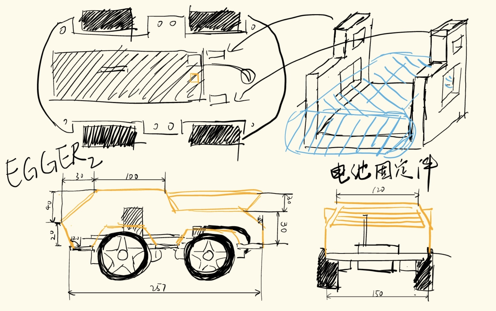
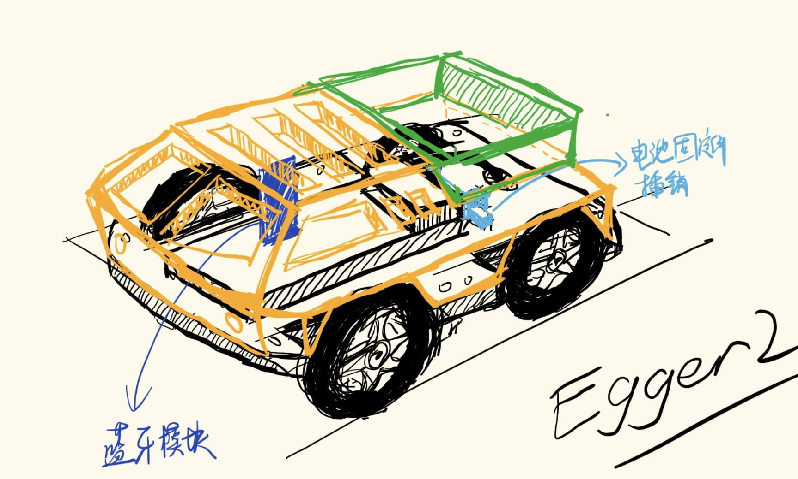

# EGGER 2

基于stm32的第二代蓝牙遥控小车

## 相较于第一代的改进

1. 控制芯片使用stm32f103c8t6
2. 四通道输出PWM波形，能够实现直流电机三档调速，各通道能够单独配置占空比
3. 优化面包板布线，单个18650 7.4v电源供电，减小电池体积
4. 在拼夕夕购置底盘基础上单独设计并打印车壳，能够完成简单的负载任务

## 控制模式

|       | 前进  | 后退  | 刹车 | 左转 | 右转 |
| ----- | ----- | ----- | ---- | ---- | ---- |
| 速度1 | @f_1* | @b_1* | @s*  | x    | x    |
| 速度2 | @f_2* | @b_2* | x    | @l*  | @r*  |
| 速度3 | @f_3* | @b_3* | x    | x    | x    |

串口发送以上数据进行小车控制，@为接收位，*为停止位

## 设计稿

## 吐槽

牛魔的拼夕夕的底盘供应商这次提供的底盘质量太差了，首先是孔没有对齐，我3D打印出来的车壳有几个孔对不上，最后使用万能的胶接给固定。然后是电机固定件和底盘的误差太大了，装好后电机仍然来回晃动，遂放弃提供的电机固定件，将电机和底盘胶接固定后再自己设计一个新的电机固定件
